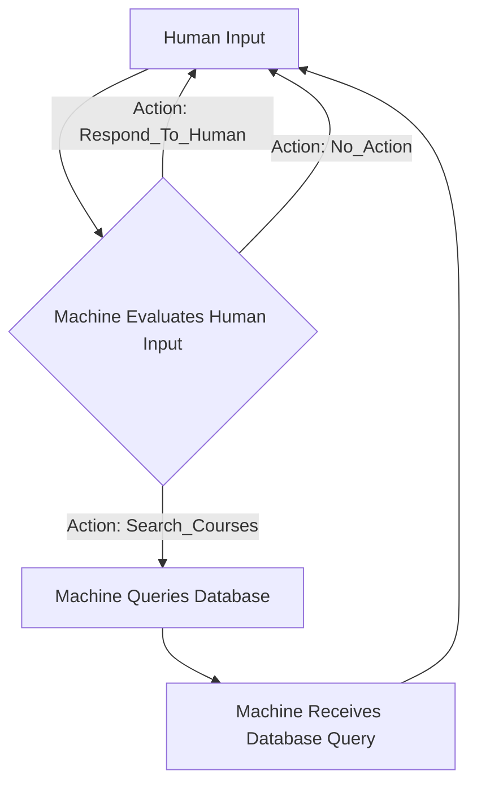

# PromptFlow

A **PromptFlow** object is a JSON representation of a workflow or decision-making process, organized as a Finite State Machine (FSM). It defines a series of states and transitions that guide the interaction flow based on prompts and responses. 

Using PromptFlow, you can have an LLM convert a workflow or knowledge process or framework into a prompt flow architecture.

## Example

One of the simplest: a self-review pattern: LLM generates an output, and then reviews its output an edits it according to some criteria.

```json
{
  "FSMName": "Review Process Flow",
  "InitialState": "Generate Initial Response",
   "States": [
     "Generate Initial Response",
     "Peer Review",
     "Summarize Reviews",
     "Finalize Review"
   ],
    "Transitions": [
      {
        "CurrentState": "Generate Initial Response",
        "Event": "Response Created",
        "NextState": "Peer Review"
      },
      {
        "CurrentState": "Peer Review",
        "Event": "Reviews Collected",
        "NextState": "Summarize Reviews"
      },
      {
        "CurrentState": "Summarize Reviews",
        "Event": "Summary Complete",
        "NextState": "Finalize Review"
      }
  ],
  "FinalState": "Finalize Review"
}
```

## PromptFlow schema

All PromptFlow objects follow this schema (note that these can get incredibly complex).

```json
{
  "$schema": "http://json-schema.org/draft-07/schema#",
  "type": "object",
  "properties": {
    "FSMName": {
      "type": "string",
      "description": "The name of the Finite State Machine."
    },
    "InitialState": {
      "type": "string",
      "description": "The initial state from which the FSM starts."
    },
    "States": {
      "type": "array",
      "description": "A list of all states within the FSM.",
      "items": {
        "type": "string"
      }
    },
    "Transitions": {
      "type": "array",
      "description": "A list of transitions between states based on events.",
      "items": {
        "type": "object",
        "properties": {
          "CurrentState": {
            "type": "string",
            "description": "The state from which the transition originates."
          },
          "Event": {
            "type": "string",
            "description": "The event that triggers the transition."
      },
          "NextState": {
            "type": "string",
            "description": "The state to which the transition leads."
          }
        },
        "required": ["CurrentState", "Event", "NextState"]
      }
    },
    "FinalState": {
      "type": "string",
      "description": "The final state of the FSM."
    }
  },
  "required": ["FSMName", "InitialState", "States", "Transitions", "FinalState"]
}
```

## Example implementation

Since PromptFlow objects are FSMs, they can be interpreted into an entire application architecture. These fit very well with a State-Driven Programming paradigm.

We will follow an example of a librarian that has access to a database. This is a chat flow where the librarian is able to query the database (i.e. a vector database full of embeddings) to fulfill a user query.

### processDescription

We have a related json schema for a processDescription -- this is a halfway point between a natural language description of a process and the PromptFlow architect who actually generates the object. This processDescription is a structured + simplified description of the task, which the PromptFlow architect uses to create their object.

```json
{
  "processDescription": "The RAG Librarian is a conversational AI system that assists users in searching for information related to courses. The system interacts with the user by accepting input, evaluating the input to determine the appropriate action, querying a database if necessary, and providing a response to the user.",
  "keyObjectives": [
    "Provide a user-friendly interface for users to interact with the RAG Librarian.",
    "Evaluate user input to determine the appropriate action.",
    "Query a database to retrieve course-related information when requested.",
    "Respond to the user with the requested information or a suitable message."
  ],
  "participantsAndRoles": [
    "User: Interacts with the RAG Librarian by providing input and receiving responses.",
    "RAG Librarian: Evaluates user input, queries the database if necessary, and generates responses to the user."
  ],
  "decisionPoints": [
    "Evaluate user input to determine the action: Search_Courses, Respond_To_Human, or No_Action.",
    "Decide whether to query the database based on the user's input."
  ],
  "challengesOrIssues": [
    "Handling diverse user inputs and determining the appropriate action.",
    "Integrating with the database to retrieve course-related information.",
    "Generating meaningful and accurate responses to the user's queries."
  ],
  "desiredOutcomes": [
    "Users can easily interact with the RAG Librarian to search for course-related information.",
    "The system accurately evaluates user input and takes the appropriate action.",
    "The database is queried efficiently to retrieve the requested information.",
    "The RAG Librarian provides clear and helpful responses to the user's queries."
  ],
  "additionalInformation": "The RAG Librarian is designed to be a user-friendly tool for accessing course-related information. It can be enhanced with additional features such as natural language processing, more sophisticated database queries, and integration with other systems."
}
```

### PromptFlow Object

Our PromptFlow Architect takes in the processDescription and generates a consistent finite state machine -- i.e. the PromptFlow!

```json
{
  "workflowName": "RAG Librarian",
  "initialState": "human_input",
  "statesDescription": [
    {
      "state": "human_input",
      "description": "Initial state where the user provides input and has command options."
    },
    {
      "state": "machine_evaluates_human_input",
      "description": "The machine evaluates the human input and decides the next action."
    },
    {
      "state": "machine_queries_database",
      "description": "The machine queries the database for the requested information."
    },
    {
      "state": "machine_receives_database_query",
      "description": "The machine receives the database query result and responds to the human."
    }
  ],
  "transitions": [
    {
      "currentState": "human_input",
      "event": "User provides input",
      "nextState": "machine_evaluates_human_input"
    },
    {
      "currentState": "machine_evaluates_human_input",
      "event": "Action: Search_Courses",
      "nextState": "machine_queries_database"
    },
    {
      "currentState": "machine_evaluates_human_input",
      "event": "Action: Respond_To_Human",
      "nextState": "human_input"
    },
    {
      "currentState": "machine_evaluates_human_input",
      "event": "Action: No_Action",
      "nextState": "human_input"
    },
    {
      "currentState": "machine_queries_database",
      "event": "Database query initiated",
      "nextState": "machine_receives_database_query"
    },
    {
      "currentState": "machine_receives_database_query",
      "event": "Database query result received",
      "nextState": "human_input"
    }
  ],
  "finalState": null
}
```

### Mermaid diagram

PromptFlow objects, as FSMs, have a 1:1 relationship with Mermaid FSM diagrams. A valid PromptFlow object can always be rendered as a mermaid diagram, and a mermaid diagram that is a valid FSM can always be rendered as a PromptFlow object.



### Python code boilerplate

PromptFlow objects, as FMS, also have a 1:1 relationship with this Python boilerplate. Functions and event handling are generated on the fly to create this state-driven program.

```python
def human_input():
    """
    Square one -- we return here after machine does all its work.
    User has some command options.
    """
    while True:
        user_input = input("You: ")
        match user_input:
            case "exit":
                return "Exiting..."
            case "/show system":
                print('============================\n' + 
                    system_prompt +
                    '\n============================\n')
                continue
            case "/show model":
                print(model.model)
                continue
            case "/show messages":
                print('============================\n' + 
                    '\n\n'.join([str(m) for m in messages]) +
                    '\n============================\n')
                continue
            case "/help":
                print("""
                Type 'exit' to leave the chat.
                Type '/show system' to see the system prompt.
                Type '/show model' to see the model.
                Type '/show messages' to see the conversation.
                """)
                continue
            case _:
                break
    return machine_evaluates_human_input

def machine_evaluates_human_input():
    """
    Machine takes human input and decides to either
    1. Respond to the human
    2. Query the database
    """
    match action:
        case "Search_Courses":
            return machine_queries_database
        case "Respond_To_Human":
            return human_input
            input
        case "No_Action":
            return human_input
        case _:
            error = "Error: Unrecognized action."
            return error

def machine_queries_database():
    """
    Machine queries the database for the requested information.
    """
    return machine_receives_database_query

def machine_receives_database_query():
    """
    Here the machine receives the database query and responds to the human.
    """
    return human_input

if __name__ == "__main__":
    current_state = human_input  # Start with the initial state
    messages = [{'role': 'system', 'content': system_prompt}]
    print("Let's chat! Type 'exit' to leave.")
    while True:
        # If the current state is not callable, it's an error. Print and break.
        if not callable(current_state):
            print(current_state)
            break
        current_state = current_state()
```