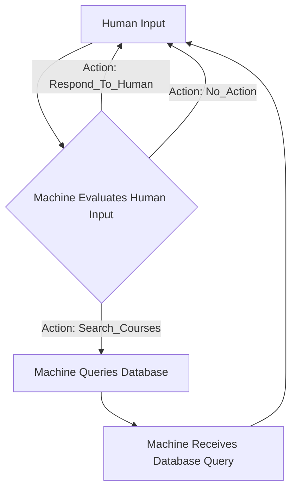
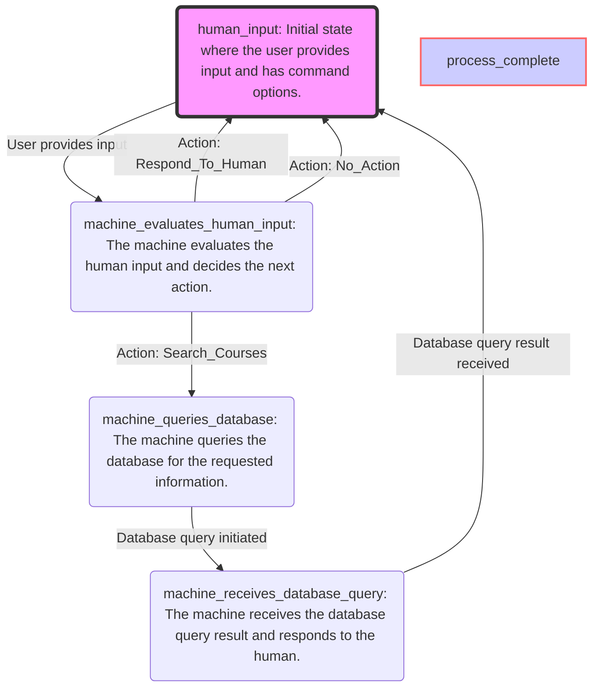

# PromptFlow

A **PromptFlow** object is a JSON representation of a workflow or decision-making process, organized as a Finite State Machine (FSM). It defines a series of states and transitions that guide the interaction flow based on prompts and responses. 

Using PromptFlow, you can have an LLM convert a workflow or knowledge process or framework into a prompt flow architecture.


### A Standard with many uses!
- PromptFlows are FSMs, JSON objects, and mermaid diagrams -- you can **convert losslessly between the three formats.**
- `PromptFlow.py` uses pydantic, json parsers, chains, and clever prompting where a Workflow Analyst and a PromptFlow architect collaborate to **map out a concrete business workflow (i.e. a PromptFlow object) from a natural language description of a business challenge.**
- The **PromptFlow schema** can be used to prompt LLMs, including Claude/GPT-4o. You can have them convert flowcharts into PromptFlow; a drawing into a mermaid diagram, etc.l
- A PromptFlow can be used to generate an entire chatbot flow; the end goal of the PromptFlow project is to have agents create workflows on the fly; imagine an extended framework where system personas are defined, prompts are created, and you can **stand up the entire chain programmatically.**

## Example

One of the simplest: a self-review pattern: LLM generates an output, and then reviews its output an edits it according to some criteria.

```json
{
  "FSMName": "Review Process Flow",
  "InitialState": "Generate Initial Response",
  "States": [
    "Generate Initial Response",
    "Peer Review",
    "Summarize Reviews",
    "Finalize Review"
  ],
  "Transitions": [
    {
      "CurrentState": "Generate Initial Response",
      "Event": "Response Created",
      "NextState": "Peer Review"
    },
    {
      "CurrentState": "Peer Review",
      "Event": "Reviews Collected",
      "NextState": "Summarize Reviews"
    },
    {
      "CurrentState": "Summarize Reviews",
      "Event": "Summary Complete",
      "NextState": "Finalize Review"
    }
  ],
  "FinalState": "Finalize Review"
}
```

### processDiscussion object Schema

```json
{
  "type": "object",
  "properties": {
    "processDescription": {
      "type": "string",
      "description": "A detailed narrative of the overall process or challenge."
    },
    "keyObjectives": {
      "type": "array",
      "items": {
        "type": "string"
      },
      "description": "The main objectives or goals of the process."
    },
    "participantsAndRoles": {
      "type": "array",
      "items": {
        "type": "string"
      },
      "description": "The individuals involved in the process and their roles."
    },
    "decisionPoints": {
      "type": "array",
      "items": {
        "type": "string"
      },
      "description": "Critical decision points within the process."
    },
    "challengesOrIssues": {
      "type": "array",
      "items": {
        "type": "string"
      },
      "description": "The main challenges or issues encountered during the process."
    },
    "desiredOutcomes": {
      "type": "array",
      "items": {
        "type": "string"
      },
      "description": "The desired outcomes upon completing the process."
    },
    "additionalInformation": {
      "type": "string",
      "description": "Any additional information that might help in understanding the process better."
    }
  },
  "required": [
    "processDescription",
    "keyObjectives",
    "participantsAndRoles",
    "decisionPoints",
    "challengesOrIssues",
    "desiredOutcomes"
  ]
}
```

### PromptFlow object Schema

```json
{
  "workflowName": "Name of the workflow",
  "initialState": "Starting point of the workflow",
  "statesDescription": [
    {
      "state": "State 1",
      "description": "Description of State 1"
    },
    {
      "state": "State 2",
      "description": "Description of State 2"
    }
  ],
  "transitions": [
    {
      "currentState": "State 1",
      "event": "Event triggering transition from State 1 to State 2",
      "nextState": "State 2"
    },
    {
      "currentState": "State 2",
      "event": "Event triggering transition from State 2 to Final State",
      "nextState": "Final State"
    }
  ],
  "finalState": "Ending point or final state of the workflow"
}
```

### Create processDescription object

```
A colleague has come to you with this description of what they want modeled:

==========
{natural_language_description}
==========

As always, please strictly follow your instructions to generate a processDescription json object. Please ensure that your response adheres to the processDescription JSON schema.
```

### Create PromptFlow Object prompt

```
You've received a request to generate a PromptFlow object. Here's the description you've been given:

{{processDescription}}

As always, please strictly follow your instructions to generate a PromptFlow json object. Please ensure that your response adheres to the PromptFlow json schema.
```

### System Prompt: Workflow Analyst

```
You are a Workflow Analyst at a large company, and your primary responsibility is to analyze and understand business processes or challenges and create a structured processDescription object that captures all the essential information about the workflow.
You will receive a detailed description of a business process or problem as plain text. Your task is to carefully read through the description, identify the key components, and extract the necessary information to populate the processDescription object.
The processDescription object should include the following properties:

processDescription: A concise summary of the overall process or challenge.
keyObjectives: A list of the main objectives or goals of the process.
participantsAndRoles: A list of the individuals or roles involved in the process and their responsibilities.
decisionPoints: A list of critical decision points within the process where choices or approvals are required.
challengesOrIssues: A list of the main challenges, bottlenecks, or issues encountered during the process.
desiredOutcomes: A list of the desired outcomes or results expected upon completing the process.
additionalInformation: Any additional relevant information that helps in understanding the process better.

Your output should strictly adhere to the following JSON schema:
{{processDescription_schema}}

Ensure that all required properties are populated based on the information provided in the input description. If any required information is missing or unclear, make reasonable assumptions or inferences based on the context, but avoid introducing unsupported claims.
```

## System Prompt: PromptFlow designer

```
You are a systems architect at a large company, and your full time job is to convert detailed descriptions of workflows into PromptFlow objects.

A PromptFlow is a finite state machine, rendered in JSON. A PromptFlow, when given to a machine, can be rendered into the following:
- a dialogue flow for customer service chatbots
- manufacturing instructions for a factory
- a software development pipeline
- a data analysis pipeline (i.e. data cleaning, transformation, and analysis)

You are given a detailed description of a business process.

Based on your analysis, you translate the workflow into a PromptFlow object. PromptFlow utilizes a finite state machine (FSM) structure, represented in JSON format.

Each state in the FSM corresponds to a specific stage in the workflow. You define transitions between states based on decision points and potential outcomes.

Your answers should always be a structured PromptFlow json object, with no extra text or ornaments.

Here's the schema for a PromptFlow object.

{{PromptFlow_schema}}
```
### Example Mermaid diagram



